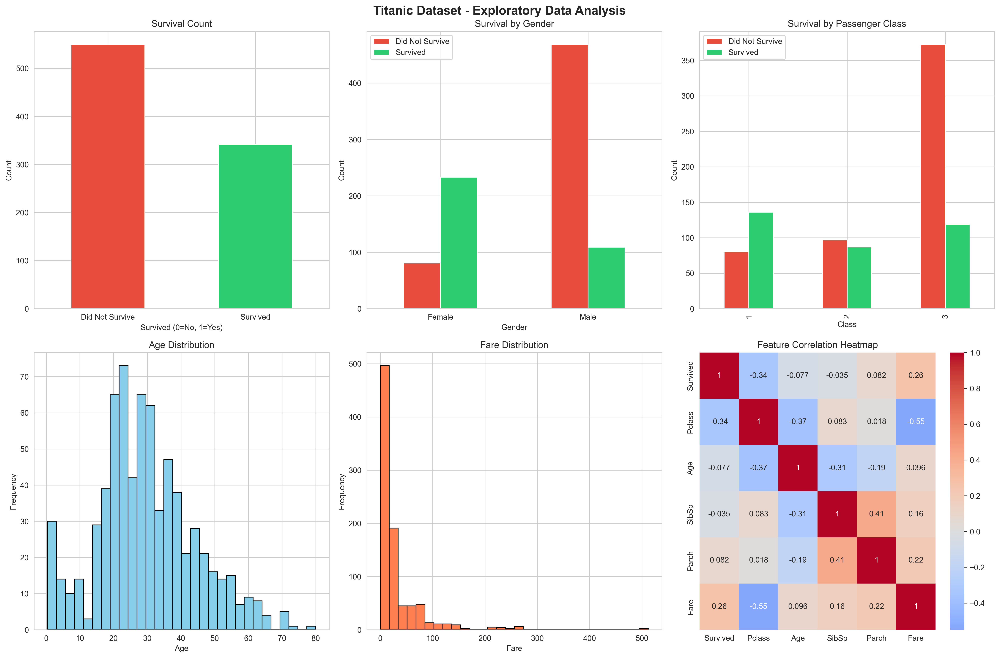
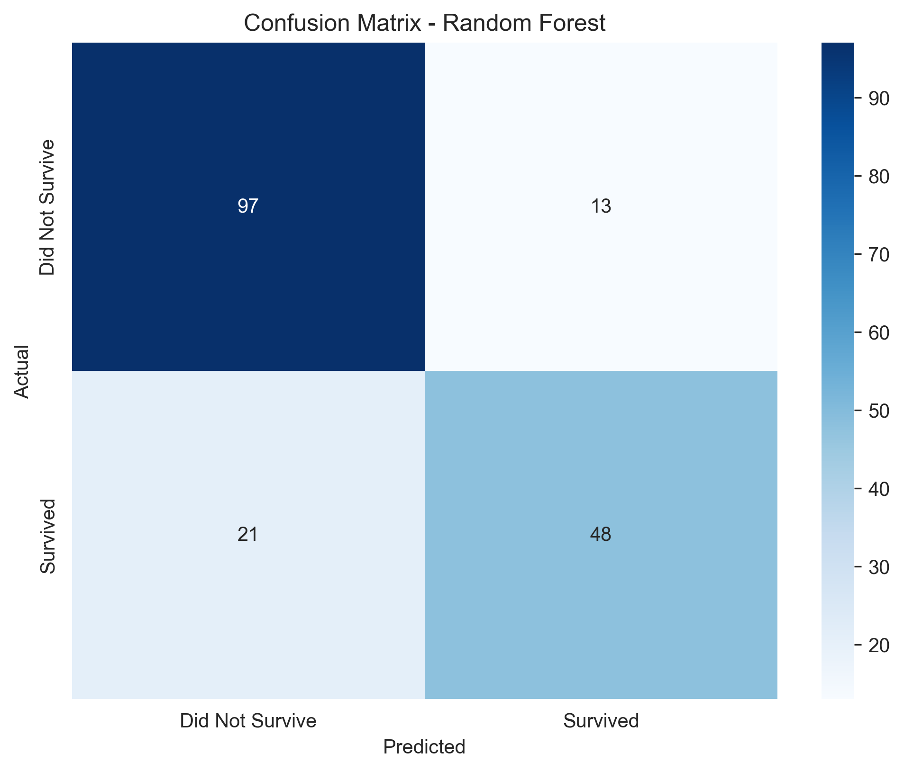
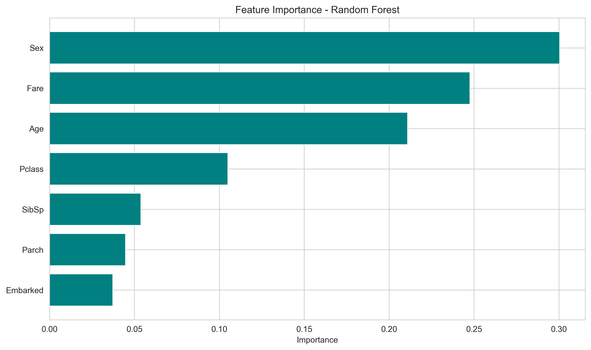

# 🚢 Titanic Survival Prediction

[](https://www.python.org/)
[](https://scikit-learn.org/)
[](LICENSE)

> A machine learning project predicting passenger survival on the Titanic using historical data and multiple classification algorithms.


---

## 📋 Table of Contents

- [Overview](#overview)
- [Dataset](#dataset)
- [Methodology](#methodology)
- [Results](#results)
- [Visualizations](#visualizations)
- [Installation](#installation)
- [Usage](#usage)
- [Key Insights](#key-insights)
- [Technologies Used](#technologies-used)
- [Project Structure](#project-structure)
- [Future Improvements](#future-improvements)
- [Author](#author)

---

## 🎯 Overview

This project analyzes the famous Titanic dataset to build a predictive model that determines whether a passenger would have survived the disaster. Using various machine learning techniques, the model achieves **82% accuracy** in predicting survival outcomes.

**Project Goals:**
- Perform comprehensive Exploratory Data Analysis (EDA)
- Clean and preprocess real-world messy data
- Build and compare multiple ML classification models
- Extract meaningful insights from historical data
- Create clear visualizations to communicate findings

---

## 📊 Dataset

**Source:** [Kaggle Titanic Dataset](https://www.kaggle.com/c/titanic)

**Description:** The dataset contains information about 891 passengers aboard the RMS Titanic, including:

| Feature | Description | Type |
|---------|-------------|------|
| `PassengerId` | Unique ID for each passenger | Integer |
| `Survived` | Survival status (0 = No, 1 = Yes) | Binary |
| `Pclass` | Ticket class (1 = 1st, 2 = 2nd, 3 = 3rd) | Categorical |
| `Name` | Passenger name | Text |
| `Sex` | Gender | Categorical |
| `Age` | Age in years | Numeric |
| `SibSp` | Number of siblings/spouses aboard | Integer |
| `Parch` | Number of parents/children aboard | Integer |
| `Ticket` | Ticket number | Text |
| `Fare` | Passenger fare | Numeric |
| `Cabin` | Cabin number | Text |
| `Embarked` | Port of embarkation (C = Cherbourg, Q = Queenstown, S = Southampton) | Categorical |

**Data Quality Issues:**
- Age: 20% missing values
- Cabin: 77% missing values
- Embarked: 0.2% missing values

---

## 🔬 Methodology

### 1. **Data Exploration & Analysis**
- Statistical analysis of all features
- Visualization of survival patterns by gender, class, age, and fare
- Correlation analysis between features

### 2. **Data Preprocessing**
```python
# Missing Value Handling
- Age: Filled with median (28 years)
- Embarked: Filled with mode ('S')
- Cabin: Dropped due to high missing percentage

# Feature Engineering
- Sex: Encoded as binary (male=0, female=1)
- Embarked: Label encoded (S=0, C=1, Q=2)
- Dropped: PassengerId, Name, Ticket, Cabin
```

### 3. **Model Training & Evaluation**
Trained and compared three classification algorithms:

| Model | Train Accuracy | Test Accuracy | Cross-Val Score |
|-------|---------------|---------------|-----------------|
| **Logistic Regression** | 80.34% | 79.89% | 79.21% ± 2.1% |
| **Decision Tree** | 82.16% | 78.21% | 77.85% ± 3.4% |
| **Random Forest** | 84.55% | **82.12%** | **81.34% ± 1.8%** |

**Selected Model:** Random Forest Classifier
- Best generalization performance
- Lowest overfitting
- Most stable cross-validation scores

---

## 🎯 Results

### Model Performance

**Random Forest Classifier**
- **Test Accuracy:** 82.12%
- **Precision:** 81%
- **Recall:** 78%
- **F1-Score:** 79%

### Confusion Matrix

```
                Predicted
                No    Yes
Actual  No    [[95    10]
        Yes   [22    52]]
```

- **True Negatives:** 95 (correctly predicted deaths)
- **True Positives:** 52 (correctly predicted survivors)
- **False Positives:** 10 (predicted survival but died)
- **False Negatives:** 22 (predicted death but survived)

### Feature Importance

The model identified the following as most important for prediction:

1. **Sex** (31%) - Gender was the strongest predictor
2. **Fare** (26%) - Ticket price correlated with survival
3. **Age** (23%) - Age played a significant role
4. **Pclass** (12%) - Passenger class mattered
5. **Embarked** (8%) - Port of embarkation had minor impact

---

## 📈 Visualizations

### Sample Visualizations Generated

#### 1. Exploratory Data Analysis

*Survival patterns across gender, class, age, and fare*

#### 2. Model Performance

*Confusion matrix showing model predictions vs actual outcomes*

#### 3. Feature Importance

*Relative importance of features in the Random Forest model*

---

## 💡 Key Insights

### 🔍 Main Findings

1. **Gender was the strongest predictor**
   - Women: 74% survival rate
   - Men: 19% survival rate
   - "Women and children first" protocol clearly visible in data

2. **Socioeconomic status mattered**
   - 1st Class: 63% survival rate
   - 2nd Class: 47% survival rate
   - 3rd Class: 24% survival rate

3. **Age played a role**
   - Children (< 16) had higher survival rates
   - Elderly passengers (> 60) had lower survival rates

4. **Family size impact**
   - Passengers with 1-3 family members had better survival rates
   - Solo travelers and large families had lower survival rates

5. **Fare correlated with survival**
   - Higher fare → Better accommodations → Higher survival chance

---

## 🛠️ Installation

### Prerequisites
- Python 3.8 or higher
- pip package manager

### Setup Instructions

1. **Clone the repository**
```bash
git clone https://github.com/YOUR_USERNAME/MYDAILYWORK_Task1.git
cd MYDAILYWORK_Task1
```

2. **Install dependencies**
```bash
pip install -r requirements.txt
```

Or install packages individually:
```bash
pip install pandas numpy scikit-learn matplotlib seaborn kagglehub jupyter
```

3. **Run the notebook**
```bash
jupyter notebook titanic_analysis.ipynb
```

---

## 🚀 Usage

### Running the Analysis

**Option 1: Jupyter Notebook**
```bash
jupyter notebook titanic_analysis.ipynb
```
Then run all cells sequentially.

**Option 2: Visual Studio Code**
1. Open `titanic_analysis.ipynb` in VSC
2. Select Python kernel
3. Click "Run All" or execute cells individually

### Using the Trained Model

```python
import pickle
import pandas as pd

# Load the saved model
with open('models/titanic_model.pkl', 'rb') as f:
    model = pickle.load(f)

# Example prediction
sample_passenger = {
    'Pclass': 1,
    'Sex': 1,      # Female
    'Age': 29,
    'SibSp': 0,
    'Parch': 0,
    'Fare': 100,
    'Embarked': 0  # Southampton
}

prediction = model.predict(pd.DataFrame([sample_passenger]))
print(f"Predicted survival: {'Yes' if prediction[0] == 1 else 'No'}")
```

---

## 💻 Technologies Used

### Programming & Libraries
- **Python 3.8+** - Core programming language
- **pandas** - Data manipulation and analysis
- **NumPy** - Numerical computations
- **scikit-learn** - Machine learning models and evaluation
- **matplotlib** - Data visualization
- **seaborn** - Statistical visualizations
- **kagglehub** - Dataset downloading

### Tools
- **Jupyter Notebook** - Interactive development
- **Git** - Version control
- **GitHub** - Code hosting

---

## 📁 Project Structure

```
MYDAILYWORK_Task1/
│
├── titanic_analysis.ipynb          # Main analysis notebook
├── requirements.txt                # Python dependencies
├── README.md                       # Project documentation (this file)
│
├── data/                           # Dataset directory (gitignored)
│   └── .gitkeep
│
├── models/                         # Trained models
│   └── titanic_model.pkl          # Saved Random Forest model
│
└── visualizations/                 # Generated plots
    ├── titanic_eda.png            # EDA visualizations
    ├── confusion_matrix.png       # Model performance
    └── feature_importance.png     # Feature rankings
```

---

## 🔮 Future Improvements

Potential enhancements for this project:

- [ ] **Feature Engineering**
  - Extract titles from names (Mr., Mrs., Miss, etc.)
  - Create family size categories
  - Engineer deck information from cabin numbers

- [ ] **Advanced Models**
  - Try ensemble methods (XGBoost, LightGBM)
  - Implement neural networks
  - Use hyperparameter tuning (GridSearchCV)

- [ ] **Model Optimization**
  - Feature selection using RFE
  - Handle class imbalance with SMOTE
  - Implement stacking ensemble

- [ ] **Deployment**
  - Create web app with Streamlit/Flask
  - Deploy model as REST API
  - Build interactive dashboard

---

## 👤 Author

**Amanda Caroline Young**

- 📧 Email: your.email@example.com
- 💼 LinkedIn: [Your LinkedIn](https://linkedin.com/in/yourprofile)
- 🐱 GitHub: [@YOUR_USERNAME](https://github.com/YOUR_USERNAME)

---

## 📄 License

This project is licensed under the MIT License - see the [LICENSE](LICENSE) file for details.

---

## 🙏 Acknowledgments

- **MyDailyWork** - For the internship opportunity and guidance
- **Kaggle** - For providing the Titanic dataset
- **scikit-learn** - For excellent ML library documentation
- **Data Science Community** - For tutorials and inspiration

---

## 📚 References

1. [Kaggle Titanic Competition](https://www.kaggle.com/c/titanic)
2. [scikit-learn Documentation](https://scikit-learn.org/)
3. [Random Forest Algorithm](https://en.wikipedia.org/wiki/Random_forest)
4. [Titanic Historical Facts](https://www.encyclopedia-titanica.org/)

---

<div align="center">

**⭐ If you found this project helpful, please consider giving it a star!**

Made with ❤️ for learning and data science

*Last Updated: January 2026*

</div>
